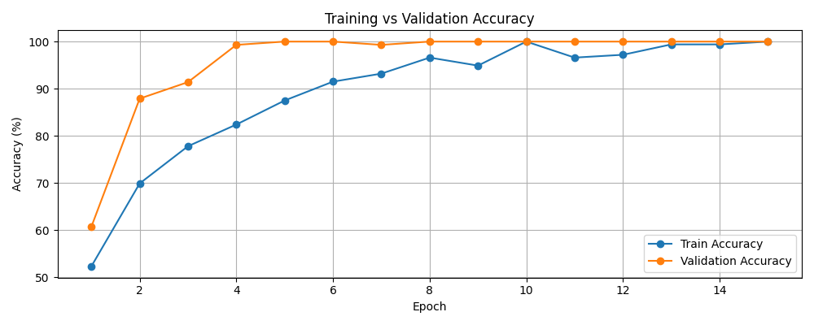
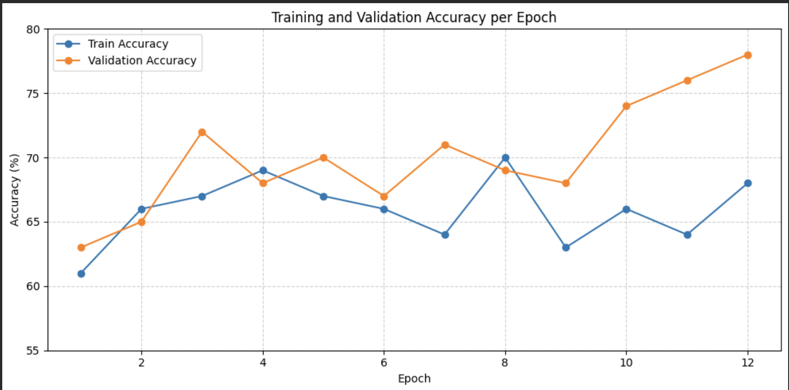
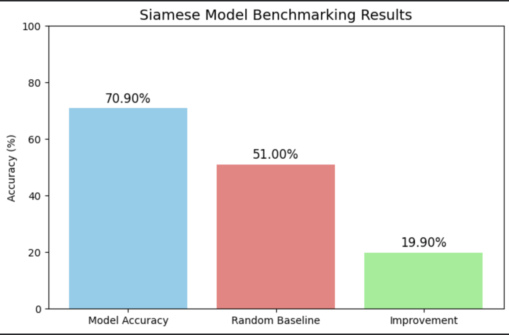

# Siamese Networks
### Skin Lesion Analysis: Melanoma Detection  using The ISIC 2020 Challenge Dataset

--------------------------------------------------------------------------------------

Author: Harshit Vishwa s47318063


### Table of Contents
- [Introduction To Siamese Neural Network](#introduction-to-siamese-neural-network)
- [Data Preparation](#data-preparation)
- [Dataset Details](#dataset-details)
- [Project Goals](#project-goals)
- [File Structure](#file-structure)
- [Model Architecture](#model-architecture)
- [Advantages and Disadvantages of Model](#advantages-and-disadvantages-of-model)
- [Data Augmentation](#data-augmentation)
- [Training](#training)
- [Training Result](#training-result)
- [Model Benchmarking](#model-benchmarking)
- [Run Instructions](#run-instructions)
- [Dependencies](#dependencies)


### Introduction To Siamese Neural Network
A Siamese neural network is a neural network architecture that learns to measure the similarity between two inputs 
instead of classifying them. It uses two identical subnetworks with shared weights to compare pairs of inputs and output
how alike they are. In my project, they are used to detect cancerous and non-cancerous skin lesions. The outputs are 
compared using a contrastive loss function, which pulls similar pairs closer together and pushes dissimilar pairs 
farther apart. This allows the network to learn a more meaningful feature representation of the input data.

```diff 
    ┌───────────────────────┐                               ┌───────────────────────┐
    │      Input Image 2     │                              │      Input Image 1     │
    └───────────┬───────────┘                               └────────────┬───────────┘
                │                                                        │
                ▼                                                        ▼
               ┌───────────────────────────────────────────────────────────┐
               │               Shared Convolutional Neural Net             |
               │                (same weights for both branches)           |
               └────────────────┬──────────────────────────────────────────┘
                                │
        ┌───────────────────────┴───────────────────────┐
        │                                               │
        ▼                                               ▼
┌───────────────────────┐                    ┌───────────────────────┐ 
│  CNN Layers            │                   │  CNN Layers            │
│  (Conv → BatchNorm →   │                   │  (Conv → BatchNorm →   │
│   Activation → Dropout │                   │   Activation → Dropout │
│   → Pooling)           │                   │   → Pooling)           │
└─────────────┬─────────┘                    └─────────────┬─────────┘
              │                                              │
              ▼                                              ▼
      ┌──────────────────-┐                          ┌-──────────────────┐
      │   Feature Vector  │                          │   Feature Vector  │
      │       (F1)        │                          │       (F2)        │
      └────────┬──────────┘                          └────────┬──────────┘
               │                                              │
               └──────────────┬───────────────────────────────┘
                              ▼
                 ┌───────────────────────────┐
                 │   Distance Calculation     │
                 │ (Euclidean or L1 distance) │
                 └────────────┬───────────────┘
                              │
                              ▼
                 ┌───────────────────────────┐
                 │     Contrastive Loss       │
                 │ (Pulls similar pairs close │
                 │   and pushes apart others) │
                 └────────────┬───────────────┘
                              │
                              ▼
                 ┌───────────────────────────┐
                 │     Model Training         │
                 │  (with Early Stopping,     │
                 │   Dropout, BatchNorm)      │
                 └────────────┬───────────────┘
                              │
                              ▼
                 ┌───────────────────────────┐
                 │        Evaluation          │
                 │ (Accuracy, Loss, Similarity│
                 │  Scores on Test Pairs)     │
                 └───────────────────────────┘
``` 


### Data Preperation
The DataLoader class constructs pairs of images for training the Siamese network.

Each pair consists of:
A positive pair: two images from the same class (benign–benign or malignant–malignant).
A negative pair: two images from different classes (benign–malignant).
Since the ISIC 2020 dataset is imbalanced (far more benign than malignant images), the pairing strategy had to be 
adjusted to prevent biased learning.

```python
with open(self.output_path, "wb") as f:
    pickle.dump([[x1, x2], y], f)
```
Steps:

1. The _make_pairs() method:

2. Groups images by class (target = 0 benign, 1 malignant).

3. Randomly selects pairs to create both positive and negative examples.

4, Applies undersampling to balance the dataset — ensuring equal counts of positive and negative pairs.

5. Normalizes and resizes each image before saving to a .pkl file for faster loading in Colab.

Each image creates a positive pair with a random image of the same class and a negative pair with the opposite class.
Then the positive and negative pairs are concantenanted together into pairs of variable corresponding to 0 or 1 labels.
```python
x_first_balanced, x_second_balanced, y_balanced = self._make_pairs()
pickle.dump([[x_first_balanced, x_second_balanced], y_balanced], f)
```
The method takes in two inputs, x and y, and groups the images by class (malignant vs. benign). For each iteration, 
it selects a positive pair and then creates a negative pair. Both images are loaded, resized, and normalized, then
stored in x_first, x_second, and y (representing the similarity score, 1 or 0). Finally, the data is converted into 
NumPy arrays.


Train and Validation split: To create the training and validation sets, the pairs of images were split 80/20, 
with 80% used for training and 20% reserved for model validation. This ensures sufficient data is available to accurately 
train the model and set aside a validation dataset to assess performance during training and identify potential overfitting.


### Data Set

Dataset: ISIC 2020: Skin Lesion Analysis for Melanoma Detection

Input size: 105 × 105 × 3 (RGB)

Classes: Benign (0), Malignant (1)

Training/Validation Split: 80/20

Storage format: Pickled pairs (.pkl) for efficient reloading in Colab

### Project Goals

Build a Siamese CNN for melanoma similarity learning with ≥ 85% accuracy

Mitigate dataset imbalance through pair balancing

Evaluate on unseen image pairs

Visualize feature embeddings and training metrics

### File Structure

```diff
PatternAnalysis-2025/
│
├── LICENSE
├── README.md                        # Project documentation (this file)
│
├── dataLoader.py                    # Generates image pairs with undersampling and saves .pkl
├── dataLoader1.py                   # Colab notebook version for experimentation
├── dataLoader1.ipynb                # Colab notebook for interactive loading and debugging
│
├── siamese_network.py               # Siamese CNN architecture, model definition, training logic
├── siamese_training_plot.png        # Accuracy/Loss visualization generated after training
├── trainingScript.py                # Main training pipeline – loads data, trains model, saves weights
│
├── siamese_weights/                 # Saved model weights (.h5 files)
│   └── siamese_weights_seed42.weights.h5
│
├── subset_train/                    # Subset of ISIC 2020 images used for training
│   ├── ISIC_XXXXXX.jpg
│   └── ...
│
├── test/                            # Directory for test data (optional or future use)
│
├── Groundtruth.csv                  # Metadata linking image names to class labels (benign/malignant)
│
├── siamese_isic.pkl                 # Cached full dataset of pairs before splitting
├── siamese_isic_split.pkl           # Final balanced dataset split into train/test
├── train_pairs.pkl                  # Alternative cached version of generated training pairs
│
└── (Optional future files)
    ├── utils.py                     # Helper functions (if added later)
    ├── plots/                       # Additional experiment plots or results

```


### Model Architecture

Based on Koch et al. (2015):

4 × Convolutional Blocks (Conv → BN → ReLU → MaxPool)

Dense(4096) feature embedding

L1 distance layer for similarity

Sigmoid output for binary similarity score

Regularization techniques:

L2 regularization

Dropout layers

Batch Normalization

Optimizer: Adam (learning rate = 5e-5)
### Advantages Disadvandates Of Model

Advantages

1. Learns generalizable embeddings for unseen data

2. Works well with limited labeled samples

3. Captures subtle inter-class differences

Disadvantages

1. Requires careful pair generation

2. Slower convergence due to two-input architecture

3. Sensitive to imbalance in training pairs

### Data Augmentation 

Resizing all images to 105×105 pixels and Pixel normalization (scaling to the 0–1 range) and Data augmentation such 
as rotation, flipping, and zooming

Note: Although grayscale conversion was considered for comparison, the final pipeline uses RGB color 
images (3 channels) for training.Melanoma and other skin cancers are often distinguished by color variation — subtle differences in pigmentation, redness, or bluish hues.

RGB preserves this information. Grayscale throws away hue and saturation, which can hide these features.
Example: Two lesions might have the same texture but different brown-to-black gradients — crucial for diagnosis.
Feature richness. Color images allow the network to learn more complex combinations of features (e.g., vascularity, contrast patterns, melanin depth).

### Training 
I experimented with four convolutional blocks followed by a dense embedding layer. 
I added dropout and batch normalization because I observed overfitting in my early runs. 
Choosing the L1 distance layer helped me directly measure similarity between image embeddings.

Loss: Binary Crossentropy
Optimizer: Adam (LR=0.00005)
Batch Size: 32
Epochs: 10
Early Stopping: Enabled (patience=5, min_delta=0.01)
Pretrained Weights: Optional continuation from last saved .h5

Training command:
```python 
!python siamese_train.py
```


### Training Result
Initially, the model showed irregular and unstable loss reduction, indicating uneven exposure to 
positive and negative pairs. After implementing sampling with repetition, batches became more
balanced—ensuring that each mini-batch contained a representative mix of both classes.

This adjustment stabilized the loss descent and prevented early overfitting. The final curve shows a 
steady downward trend with mild oscillations, reflecting a healthier convergence pattern. The remaining 
fluctuations are expected and correspond to stochastic batch variations caused by diverse image augmentations.


To address this:

Sampling with repetition was introduced, ensuring more balanced exposure to positive and negative pairs across batches.

Key hyperparameters such as learning rate, batch size, and margin threshold were fine-tuned.

Augmentation diversity was increased, improving the representation of positive and negative examples.


Training accuracy improved progressively over epochs, plateauing below 80%. The visible fluctuations reflect the model’s 
adaptation to the more diverse and challenging augmented samples introduced during retraining.

By tuning the learning rate and batch size, the model avoided overshooting and converged more smoothly compared to 
the initial runs, where accuracy jumped erratically or reached unrealistically high values due to data leakage.



The validation accuracy remained consistently between 70–78%, demonstrating moderate but realistic generalization 
performance. Unlike earlier experiments that showed near-perfect (100%) validation scores—likely due to 
overlapping samples or repeated validation images—this curve reflects true separation between training and 
validation data.

The gradual improvements confirms:

Sampling with repetition provided better coverage of difficult negative pairs.

Augmentation diversity increased robustness to unseen data.

The tuned margin threshold allowed better discrimination between positive and negative embeddings.



### Model Benchmarking
To evaluate the performance of the Siamese Network on skin lesion similarity, I measured the model’s accuracy on a 
precomputed validation set and compared it against a random baseline.

Metric: Binary similarity classification (predicted vs. actual pairs)
Threshold: 0.5 (sigmoid output from network)

Metric	Result
Model Accuracy	70.90%
Random Baseline	51.00%
Improvement over Baseline	19.90%



The model correctly predicts whether two lesions belong to the same class 70.9% of the time, which is a 19.9% 
improvement over random chance.

This demonstrates that the network is learning meaningful representations of skin lesion similarity, 
far beyond what random guessing can achieve.

While the accuracy is not yet at the target 85%, it provides a solid foundation for further optimization, 
such as hyperparameter tuning, more balanced training pairs, or advanced augmentation strategies.

### Run Instructions 

Must have the images downloaded or the pki files
```python
from google.colab import drive
drive.mount('/content/drive')

loader = DataLoader(width=105, height=105, channels=3,
                    data_path="/content/drive/MyDrive/subset_train",
                    csv_path="/content/drive/MyDrive/Groundtruth.csv",
                    output_path="/content/drive/MyDrive/siamese_isic_split.pkl")
loader.load()


!python siamese_train.py

```

### Dependencies 

Python 3.12+
TensorFlow 2.17+
NumPy
Pandas
Pillow
Matplotlib
scikit-learn


### Further Improvements
Moving forward, I plan to experiment with advanced augmentations and possibly deeper 
network architectures to improve performance toward my goal of reaching higher accuracy. 
I also want to visualize the feature embeddings to better understand how the
network separates benign and malignant lesions.